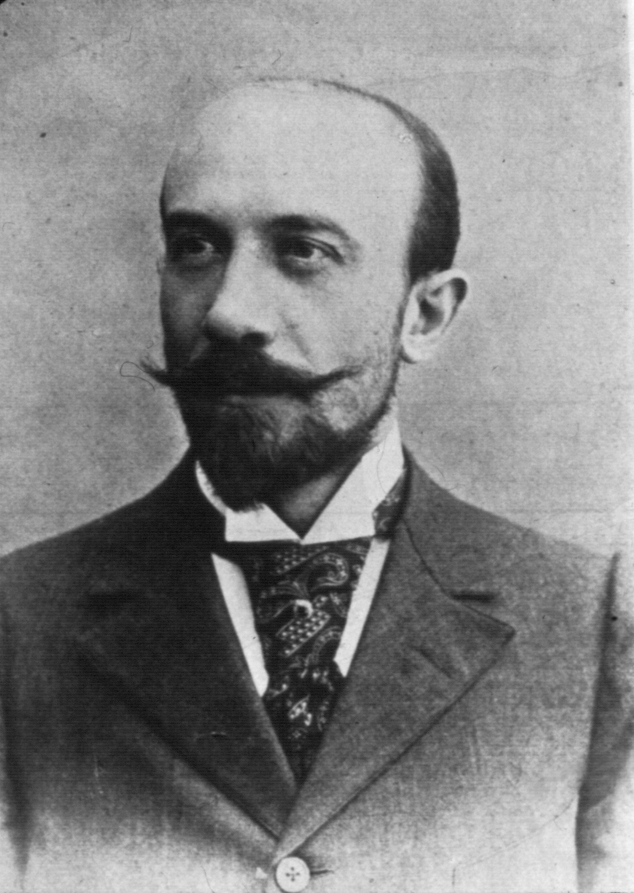
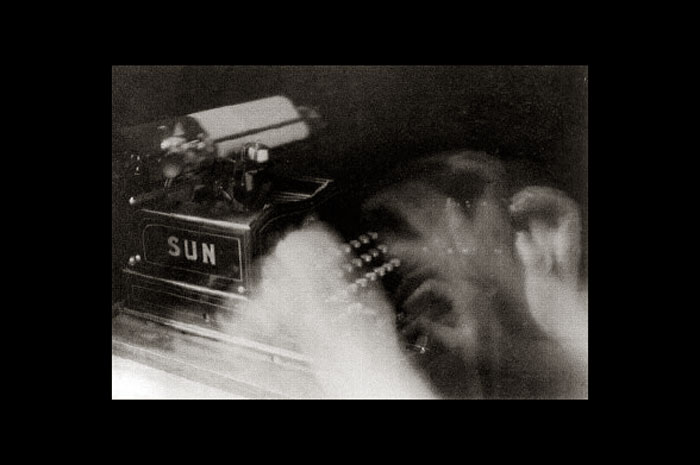

# Corpus d'art vidéo {#corpus}

(non exaustif bien sur)

## Les origines 

## Eadward Muybridge

<center>
{width=50%} 

{width=50%} 

{width=50%} 


</center>

* https://fr.wikipedia.org/wiki/Ph%C3%A9nakistiscope
* https://fr.wikipedia.org/wiki/Eadweard_Muybridge
* http://www.artwiki.fr/?EdwardMuybridge


## Georges Mélies 
<center>
{width=50%} 

{width=50%} 

{width=50%} 

{width=50%} 

</center>

* http://www.artwiki.fr/?GeorgesMelies
* https://fr.wikipedia.org/wiki/Georges_M%C3%A9li%C3%A8s


## Dziga Vertov
<center>


</center>

* https://www.moma.org/explore/inside_out/2010/04/20/dziga-vertov/
* http://www.artwiki.fr/?DzigaVertov


## Futurisme et l'art vidéo

## Umberto Boccioni
<center>
,_oil_on_canvas,_70_x_95_cm,_Gianni_Mattioli_Collection,_on_long-term_loan_to_the_Peggy_Guggenheim_Collection,_Venice.jpg)

## Anton Giulio Bragaglia
<center>

{width=50%}

{width=75%}

{width=75%}

{width=75%}

{width=75%}

{width=75%}

{width=75%}

{width=75%}

{width=75%}

{width=75%}

{width=75%}


<iframe width="640" height="480" src="https://www.youtube.com/embed/TxaIk26Pc-g" frameborder="0" allow="accelerometer; autoplay; clipboard-write; encrypted-media; gyroscope; picture-in-picture" allowfullscreen></iframe>

</center>

* https://www.italianways.com/past-and-futurism-in-bragaglias-photodynamics/
* http://www.artwiki.fr/?FuturismeArtvideo

## Marcel Duchamp
<center>
{width=75%}


<iframe width="100%" height="480px"  src="https://www.youtube.com/embed/dXINTf8kXCc" frameborder="0" allow="accelerometer; autoplay; clipboard-write; encrypted-media; gyroscope; picture-in-picture" allowfullscreen></iframe>
> Rotoreliefs, 1926


</center>

> La participation du spectateur, l'oeuvre ouverte:
>
> «Ce sont les regardeurs qui font les tableaux»
>
> «Somme toute, l'artiste n'est pas seul à accomplir l'acte de création car le spectateur établit le contact de l'oeuvre avec le monde extérieur en déchiffrant et en interprétant ses qualifications profondes et par là, ajoute sa propre contribution au processus créatif.»  
> -- <cite>Marcel Duchamp</cite>


> Il invente par ses Rotoreliefs l'Art cinétique


* http://www.artwiki.fr/?MarcelduchampEcologie
* https://fr.wikipedia.org/wiki/Marcel_Duchamp


## Stan Brakhage

<center>
.jpg){width=50%}


<iframe width="100%" height="480px" src="https://www.youtube.com/embed/S5P5vkegmvU" frameborder="0" allow="accelerometer; autoplay; clipboard-write; encrypted-media; gyroscope; picture-in-picture" allowfullscreen></iframe>
 > Mothlight - Stan Brakhage [1963]
 >
 > On retrouve cette technique d'intervention sur la pellicule de manière encore plus marquée pour Mothlight, en 1963. Pour ce court-métrage, Brakhage ne s'est pas servi de caméra : il a inséré entre deux pellicules des feuilles et des insectes, ce qui donne de nouveau un rythme de défilement extrêmement rapide.
 > <cite> art wiki </cite>


<iframe width="100%" height="480px" src="https://www.youtube.com/embed/ESLn1OUxMGI" frameborder="0" allow="accelerometer; autoplay; clipboard-write; encrypted-media; gyroscope; picture-in-picture" allowfullscreen></iframe>
> The Dante Quartet - Stan Brakhage [1987]

</center>

* http://www.artwiki.fr/?StanBrakhage
* https://en.wikipedia.org/wiki/Stan_Brakhage


## John Milton Cage
* http://www.artwiki.fr/?JohnCage

## Fluxus
* http://www.artwiki.fr/?LartvideoFluxus

## Norman McLaren


<iframe width="100%" height="480px" src="https://www.youtube.com/embed/Q0vgZv_JWfM" frameborder="0" allow="accelerometer; autoplay; clipboard-write; encrypted-media; gyroscope; picture-in-picture" allowfullscreen></iframe>
> Pen Point Percussion (1958)

<iframe width="100%" height="480px" src="https://www.youtube.com/embed/0yJRWUAKgnY" frameborder="0" allow="accelerometer; autoplay; clipboard-write; encrypted-media; gyroscope; picture-in-picture" allowfullscreen></iframe>
> Mosaic (1965)

<iframe width="100%" height="480px" src="https://www.youtube.com/embed/UmSzc8mBJCM" frameborder="0" allow="accelerometer; autoplay; clipboard-write; encrypted-media; gyroscope; picture-in-picture" allowfullscreen></iframe>
> Synchromy (1971)

<iframe width="100%" height="480" src="https://www.youtube.com/embed/86Wp96uG-N8" frameborder="0" allow="accelerometer; autoplay; clipboard-write; encrypted-media; gyroscope; picture-in-picture" allowfullscreen></iframe>
> A Phantasy in Colors (1949)

* https://www.onf.ca/cineastes/norman-mclaren/
* https://fr.wikipedia.org/wiki/Norman_McLaren
* http://www.artwiki.fr/?NormanMcLaren

## 1960 et le début de la vidéo

```{r, echo=FALSE,out.width="49%",fig.cap="Enregistrer et reproduire depuis un support magnétique",fig.show='hold',fig.align='center'}
knitr::include_graphics(c("medias/corpus/1960/Charles_Bensinger_video_guide_2.jpg","medias/corpus/1960/Charles_Bensinger_video_guide_3.jpg"))
``` 

* https://cool.culturalheritage.org/videopreservation/vid_guide/
* https://en.wikipedia.org/wiki/Portapak


## Nam June Paik
<center>


```{r, echo=FALSE,out.width="32%",fig.cap="Enregistrer et reproduire depuis un support magnétique",fig.show='hold',fig.align='center'}
knitr::include_graphics(c("medias/corpus/paik/____NamJunepaik_0220452w_namjunepaikzenfortv1961975_vignette_300_209_20150414152312_20150414153250.jpg","medias/corpus/paik/__NamJunepaik_22222_vignette_300_209_20150414121039_20150414121316.jpg","medias/corpus/paik/_NamJunepaik_paik_magnet_tv_20150506194428_20150506194457.jpg"))
``` 

</center>
* http://www.artwiki.fr/?NamjunePaik
* https://fr.wikipedia.org/wiki/Nam_June_Paik

## Wolf Vostell
* http://www.artwiki.fr/?WolfVostell

## Les Levine
* http://www.artwiki.fr/?LesLevine

## 1970

## Valie Export
* http://www.artwiki.fr/?ValieExport

## Frank Gillette
* http://www.artwiki.fr/?FrankGillette

## Michael Snow
* http://www.artwiki.fr/?MichaelSnow

## Jud Yalkut
* http://www.artwiki.fr/?JudYalkut

## Shigeko Kubota
* http://www.artwiki.fr/?ShigekoKubota

## Marina Abramovic & Ulay
* http://www.artwiki.fr/?AbramoviculayVideo70


## Contemporains


## Cinéma Expérimental

* http://www.artwiki.fr/?CinemaExperimental

## Jean-Pierre Boyer 

{width=50%}


* https://www.horschamp.qc.ca/spip.php?article535
* https://vitheque.com/en/directors/jean-pierre-boyer
* https://www.fondation-langlois.org/html/e/page.php?NumPage=1839
* https://www.fondation-langlois.org/html/e/research.php?zoom=3&Filtres=5&Numero=i00005710&MotsCles=Jean-Pierre+Boyer


## David Rokeby

<center>

{width=75%}

Very Nervous System (1986-90)

<iframe src="https://player.vimeo.com/video/17231343" width="640" height="480" frameborder="0" allow="autoplay; fullscreen; picture-in-picture" allowfullscreen></iframe>
<p><a href="https://vimeo.com/17231343">Very Nervous System (1987 version)</a> from <a href="https://vimeo.com/davidrokeby">David Rokeby</a> on <a href="https://vimeo.com">Vimeo</a>.</p>


<iframe src="https://player.vimeo.com/video/8120954" width="640" height="424" frameborder="0" allow="autoplay; fullscreen; picture-in-picture" allowfullscreen></iframe>
<p><a href="https://vimeo.com/8120954">Very Nervous System (1982-1991) by David Rokeby</a> from <a href="https://vimeo.com/davidrokeby">David Rokeby</a> on <a href="https://vimeo.com">Vimeo</a>.</p>


</center>

* https://www.fondation-langlois.org/html/e/page.php?NumPage=1951
* http://www.davidrokeby.com/vns.html


## Dérapages 

https://www.youtube.com/results?search_query=derapage+festival

https://www.youtube.com/watch?v=lvUH7b8x1DM

https://www.youtube.com/watch?v=w3tx2bgip4o

https://www.youtube.com/watch?v=sGUgCo1PkzE

https://www.youtube.com/watch?v=DJgUtwhClj4

https://www.youtube.com/watch?v=PPZP2A972LM

https://www.youtube.com/watch?v=JUqmzbIsaAs