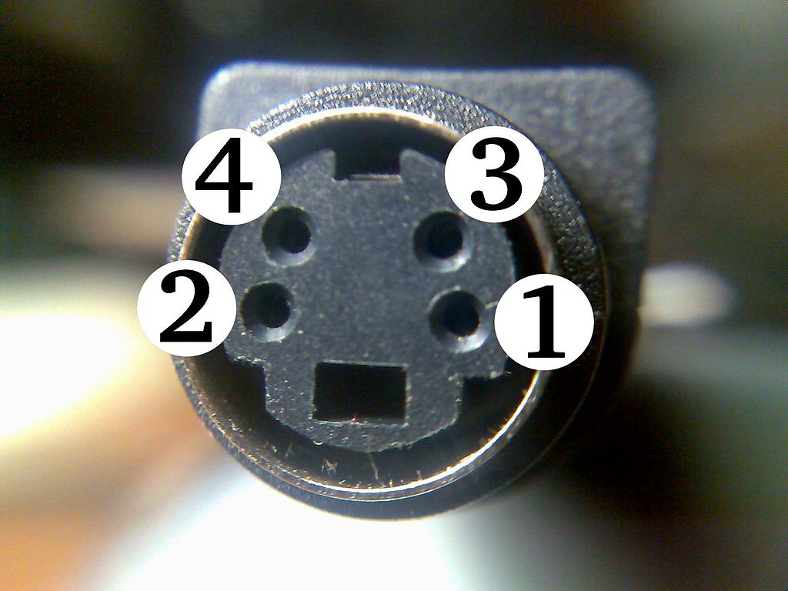

# Lexique technique et technologique{#lexique}

## Constituantes du signal vidéo{#lexique_composantes}

### Analogue vs numérique

Est-ce que le signal est une variation de fluctuation électrique flottante (analogue) ou binaire (numérique)

* [Signaux analogues/digitaux](https://en.wikipedia.org/wiki/Video#Analog_video){target="_blank"}
* [transmission télévisuelle analogue](https://en.wikipedia.org/wiki/Analog_television){target="_blank"}

#### Protocole de transport

https://en.wikipedia.org/wiki/Video

##### Analogues

| Composite					| S-Video 					| Component 					| VGA					 | TRRC					 |
| -							| -							| - 							| -						| -						|
|   |  | |  |  | 

Table: Protocoles de transport pour signaux vidéos analogues (Amérique du Nord)

* Conversions passives
	* **S-Vidéo** peut être converti passivement vers **Composite** considérant une perte de qualité. (S-Vidéo > Composite) 
	* Composite et TRRC peuvent s'interchanger considérant la perte des canaux audio présents sur le TRRC

##### Numériques

| DVI					| HDMI 					|  Display Port 					| SDI					 | 
| -							| -							| - 							| -						| 
|   |  |  |  |

Table: Protocoles de transport pour signaux vidéos numériques

* Conversions passives :
	* **Display Port ** peut passer passivement vers HDMI ainsi que DVI. Le contraire n'est pas vrai. On ne peut pas passer de passivement de HDMI vers Display port.
	* HDMI peut passer la vidéo vers DVI et vice versa, par contre le son est perdu dans cette conversion 

### Résolution 

Associé au nombre de pixels horizontaux et verticaux composant une image. 
Généralement exprimé par le nombre de pixel horizontal X nombre de pixel vertical

$$
résolution  = PixelH * PixelV 
$$

### Cadence

<<<<<<< HEAD

#### Pour aller plus loin 

##### Encodage binaire avancé

* https://github.com/sebpiq/cours-son-reseaux/blob/main/data-encodage.md

* pour des usages réguliers voir : 
=======
Associé à la vitesse, généralement exprimé en images / secondes

$$
images / secondes
$$
>>>>>>> d2ec939891dc36f1d637ffb7c38c43c829fdadf8

* [Cadence](https://frames-per-second.appspot.com){target="_blank"} 

### Trame
* [Trame (progressif/entrelacé)](https://web.archive.org/web/20140222010640/http://neuron2.net/LVG/interlacing.html){target="_blank"}

