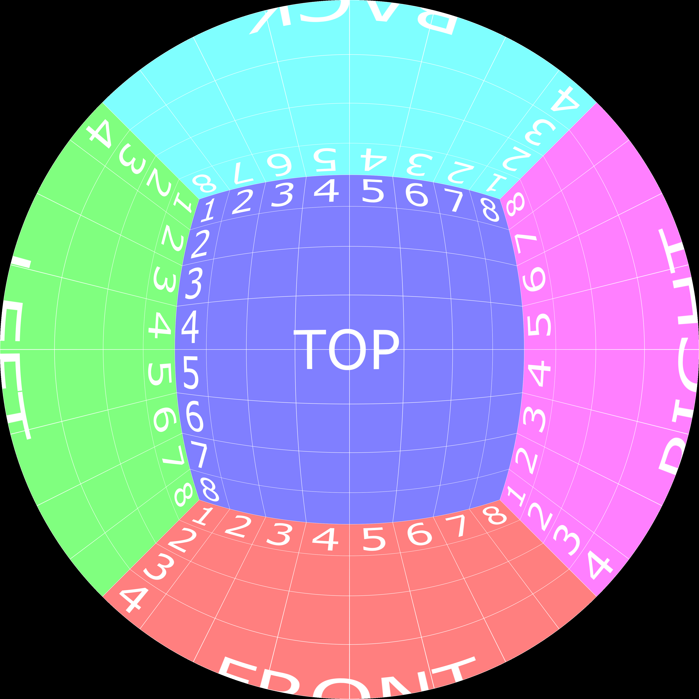

# Acquerir {#acquerir}

## Rapport de cadre (Ratio)

* S'écrit généralement en utilisant le deux point pour séparer la largeur de la hauteur. 

$$
largeur : hauteur 
$$

Parfois on utilise aussi le barre de division 

$$
largeur / hauteur 
$$

* Généralement exprimé avec ratio entier

### 16:9

* Ratio vidéo légèrement panoramique standard.

### 4:3

* ratio vidéo utilisé au temps des tubes cathodiques 

* Attention; ce format provenant du monde analogue et est soumis parfois des variations exotiques
https://en.wikipedia.org/wiki/Pixel_aspect_ratio#Analog-to-digital_conversion

### 3:2
* Ratio provenant du film [35mm](https://en.wikipedia.org/wiki/35_mm_format) qui mesurait réellement 36×24 mm

* Ratio généralement utilisé en photographie

### 2,39:1 

* CinemaScope; https://fr.wikipedia.org/wiki/CinemaScope 
	* Jadis, déformation optique au tournage ainsi qu'à la diffusion 

	
* Épique 

### 1:1 

* Ratio provenant de la photographie [moyen format](https://fr.wikipedia.org/wiki/Appareil_photographique_de_moyen_format) 

* Utilie pour 
	* texture vidéo
	* [Format dôme immersif](https://vioso.com/softedge-patterngenerator/domegrids/CubeMap_4096x4096.png)

### Générateur d'image de calibration 

* interface web 
	* https://vioso.com/testpattern-generator/

### Références 

* https://fr.wikipedia.org/wiki/Format_d%27image
* [ratios image](https://en.wikipedia.org/wiki/Display_aspect_ratio){target="_blank"}
* [ratios-pixels](https://en.wikipedia.org/wiki/Pixel_aspect_ratio){target="_blank"}

## Physique de l'imagerie numérique

### Le système oculaire

* http://what-when-how.com/display-i\nterfaces/the-human-visual-system-display-interfaces-part-1/

### Numériser la lumière réfléchie

* http://what-when-how.com/introduction-to-video-and-image-processing/image-acquisition-introduction-to-video-and-image-processing-part-1/

### Propriétés de l'image numérique 

* http://what-when-how.com/introduction-to-video-and-image-processing/image-acquisition-introduction-to-video-and-image-processing-part-2/

## Acquisition vidéo numérique temps réel {#acquerir_captation}

### Sources vidéo OBS

#### Périphérique de capture vidéo 
* Webcam
* Carte de capture HDMI

#### Capture d'écran

#### Capture de fenêtre 

#### Capture de contexte GL (Game capture)

#### Partage de texture vidéo  (Spout, Syphon)

#### Caméra virtuelle 

#### Navigateur

### Tutoriels OBS francophone démystifiant l'interface

* https://www.leterminal.fr/manuel-obs-studio/
* https://maniacgeek.net/informatique/obs/utiliser-obs-guide/
* https://sospc.name/obs-studio-tutoriel-mia/

