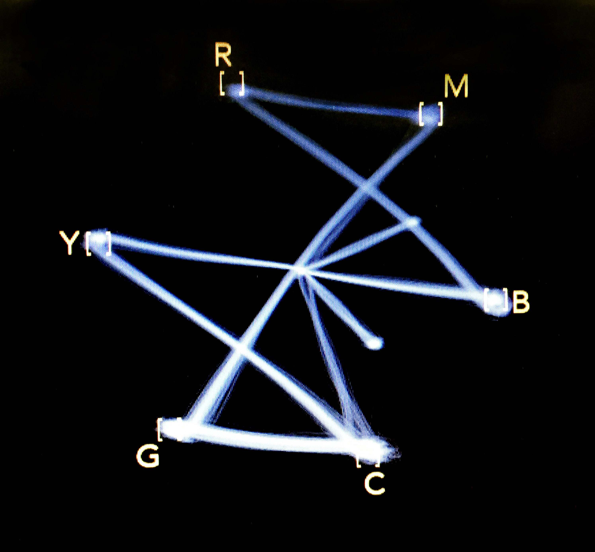

--- 
title: "Traitement vidéo"
author: "Guillaume Arseneault"
date: "`r Sys.Date()`"
site: bookdown::bookdown_site
lang: fr
output:
  bookdown::gitbook:
    lib_dir: assets
    split_by: section
    config:
      toolbar:
        position: static
      fontsettings:
        theme: white
        family: sans
        size: 2
  bookdown::pdf_book:
    keep_tex: yes
  bookdown::html_book:
    css: toc.css
  bookdown::word_document:
    toc: true
header-includes:
   - \usepackage{subfig}
documentclass: book
bibliography: [book.bib, packages.bib, 582543-traitement-video.bib]
biblio-style: apalike
link-citations: yes
graphics: yes
github-repo: tim-montmorency/543-traitement-video
description: "Le traitement vidéo temps réel, une documentation expérimentale"
cover-image: images/cover.png
favicon: images/favicon.ico
---
# Lisez-moi {-}

```{r echo=FALSE, fig.cap = 'Barres de calibration couleur sur vectorscope [@marsh_ColorBarsVectorscope_2016]'}

```

## Sources {-}

Compilation via Bookdown [@xie_BookdownAuthoringBooks_2020] 

* *GIT*[@torvalds_Git_2006] hébergé [github.com/tim-montmorency/543-traitement-video](https://github.com/tim-montmorency/543-traitement-video){target="_blank"}
* *Libre*[@stallman_GnuOrg_1983] 
* Écrit en *RMarkdown*[@allaire_RmarkdownDynamicDocuments_2020]  
  * [HTML](https://tim-montmorency.com/543-traitement-video/){target="_blank"}
  *	[PDF](https://tim-montmorency.com/543-traitement-video/traitement-video.pdf){target="_blank"}
  * [EPUB](https://tim-montmorency.com/543-traitement-video/traitement-video.epub){target="_blank"}
* [Bibliographie Bibtex](https://github.com/tim-montmorency/543-traitement-video/blob/master/582543-traitement-video.bib){target="_blank"} 


